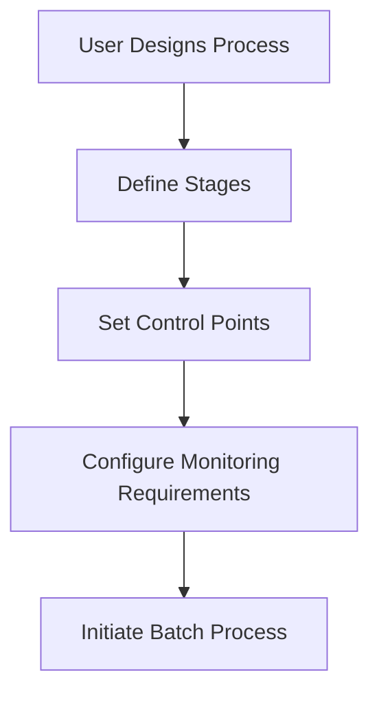
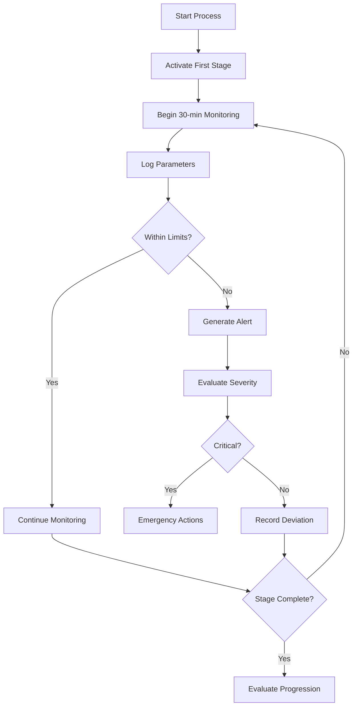
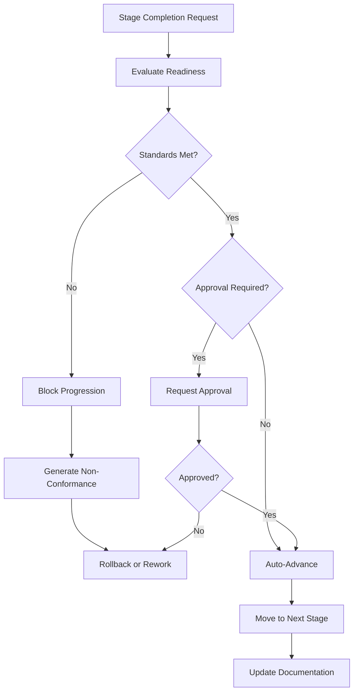

# Enhanced Production Process Management System
## ISO 22000:2018 Compliant Manufacturing Process with Stage-Based Control

### Executive Summary

I have designed and implemented a comprehensive enhancement to your production module that transforms it into a highly efficient, ISO-compliant manufacturing system. The new system implements stage-based process control with automated monitoring, quality gates, and approval workflows that meet international manufacturing standards.

---

## 🎯 Key Features Implemented

### 1. **ISO 22000:2018 Compliant Process Flow**
- **Stage-Based Process Management**: Complete finite state machine (FSM) implementation for controlled batch progression
- **Critical Control Points (CCP)**: Automated monitoring and validation of food safety critical limits
- **Operational Prerequisite Programs (OPRP)**: Systematic monitoring of operational parameters
- **Documentation & Traceability**: Complete audit trail for regulatory compliance

### 2. **Automated 30-Minute Monitoring Cycles**
- **Continuous Parameter Logging**: Automated collection of temperature, pH, pressure, time, and other critical parameters
- **Real-Time Deviation Detection**: Immediate alerts when parameters exceed tolerance limits
- **Equipment Integration Ready**: Framework for IoT sensor integration and automated data collection
- **Statistical Process Control (SPC)**: Control charts and capability studies for process optimization

### 3. **Intelligent Batch Progression**
- **Quality Gates**: Each stage validates completion criteria before allowing progression
- **Approval Workflows**: Multi-level approval system for critical decisions and deviations
- **Rollback Mechanisms**: Ability to return batches to previous stages when standards aren't met
- **Emergency Procedures**: Emergency transition capabilities for critical situations

### 4. **Enhanced Control & Monitoring**
- **Real-Time Alerts**: Automated generation of alerts for deviations, equipment issues, and quality concerns
- **Escalation Management**: Severity-based alert escalation to appropriate personnel
- **Performance Analytics**: Comprehensive reporting on process efficiency, quality metrics, and compliance
- **Trend Analysis**: Historical data analysis for continuous improvement

---

## 🏗️ System Architecture

### Core Services

#### 1. **ProcessMonitoringService** (`process_monitoring_service.py`)
```python
# Key Capabilities:
- Automated 30-minute parameter logging
- Continuous CCP monitoring
- Deviation detection and alert generation
- Stage completion readiness assessment
- Equipment calibration verification
```

#### 2. **BatchProgressionService** (`batch_progression_service.py`)
```python
# Key Capabilities:
- Controlled stage transitions with quality gates
- Multi-type transition support (normal, rollback, skip, emergency, rework)
- Approval workflow management
- Time and quality requirement validation
- Comprehensive compliance evaluation
```

#### 3. **Enhanced API Endpoints** (`batch_progression.py`)
```python
# Key Endpoints:
- POST /batches/{id}/initiate-process    # Start new batch process
- POST /processes/{id}/start             # Begin active processing
- GET  /processes/{id}/stages/{id}/evaluate  # Assess progression readiness
- POST /processes/{id}/stages/{id}/transition # Request stage transition
- GET  /processes/{id}/compliance-report     # Generate compliance report
```

---

## 📋 Production Process Workflow

### Phase 1: Process Design & Initiation


1. **Process Template Creation**: Define process type, stages, and control points
2. **Stage Configuration**: Set up each stage with monitoring requirements, time limits, and quality criteria
3. **Control Point Definition**: Specify critical limits, tolerances, and monitoring frequencies
4. **Batch Initiation**: Create process instance linked to specific batch

### Phase 2: Active Process Management


2. **Automated Monitoring**: Every 30 minutes, system logs critical parameters
3. **Real-Time Validation**: Immediate comparison against tolerance limits
4. **Alert Generation**: Automatic alerts for deviations with severity assessment
5. **Quality Gates**: Evaluation of stage completion readiness

### Phase 3: Stage Progression Control


4. **Progression Evaluation**: Comprehensive assessment of quality, time, and compliance
5. **Approval Workflows**: Multi-level approval for critical transitions
6. **Transition Execution**: Controlled movement between stages
7. **Documentation Updates**: Complete audit trail maintenance

---

## 🔍 Quality Control & Compliance Features

### Critical Control Points (CCP) Management
- **Automated Monitoring**: Continuous monitoring of critical parameters
- **Limit Validation**: Real-time comparison against critical limits
- **Immediate Actions**: Automatic alerts and corrective action triggers
- **Documentation**: Complete records for regulatory compliance

### Statistical Process Control (SPC)
- **Control Charts**: X-bar, R, CUSUM, and EWMA charts for trend analysis
- **Capability Studies**: Cp, Cpk, and process sigma level calculations
- **Violation Detection**: Nelson rules implementation for out-of-control detection
- **Performance Metrics**: First pass yield, overall yield, and quality rates

### Deviation Management
- **Automatic Detection**: Real-time identification of parameter deviations
- **Severity Assessment**: Automatic classification (low, medium, high, critical)
- **Root Cause Categories**: 5M categorization (Man, Machine, Material, Method, Environment)
- **Corrective Actions**: Structured approach to deviation resolution

---

## 📊 Enhanced Reporting & Analytics

### Real-Time Dashboards
- **Process Status**: Live view of all active processes and stages
- **Parameter Trends**: Real-time parameter visualization with control limits
- **Alert Summary**: Active alerts with severity indicators
- **Quality Metrics**: Live quality scores and compliance status

### Compliance Reporting
- **ISO 22000:2018 Reports**: Comprehensive compliance status reports
- **CCP Monitoring Reports**: Critical control point performance summaries
- **Deviation Analysis**: Trend analysis and root cause reporting
- **Audit Trail Reports**: Complete documentation for regulatory audits

### Performance Analytics
- **Yield Analysis**: First pass yield, overall yield, waste analysis
- **Process Capability**: Statistical capability assessments
- **Trend Analysis**: Historical performance trends and predictions
- **Efficiency Metrics**: Cycle times, throughput, and resource utilization

---

## 🚀 Implementation Benefits

### 1. **Regulatory Compliance**
- ✅ **ISO 22000:2018**: Food safety management system compliance
- ✅ **GMP**: Good Manufacturing Practice adherence
- ✅ **ISA-88**: Batch process control standard implementation
- ✅ **Audit Ready**: Complete documentation and traceability

### 2. **Operational Excellence**
- ✅ **Automated Quality Control**: Reduces human error and ensures consistency
- ✅ **Real-Time Monitoring**: Immediate detection and response to issues
- ✅ **Predictive Analytics**: Trend analysis for proactive problem prevention
- ✅ **Resource Optimization**: Improved efficiency and reduced waste

### 3. **Risk Management**
- ✅ **Early Warning System**: Automated alerts prevent quality issues
- ✅ **Controlled Processes**: Stage-based control prevents non-conforming products
- ✅ **Traceability**: Complete batch history for recall management
- ✅ **Documentation**: Comprehensive records for liability protection

### 4. **Continuous Improvement**
- ✅ **Data-Driven Decisions**: Statistical analysis guides improvements
- ✅ **Performance Metrics**: Clear KPIs for measuring progress
- ✅ **Root Cause Analysis**: Systematic approach to problem solving
- ✅ **Best Practice Capture**: Template system preserves successful processes

---

## 🔧 Technical Implementation Details

### Database Enhancements
The existing production models have been enhanced with:
- **ProcessStage**: Enhanced FSM management with monitoring integration
- **StageMonitoringRequirement**: Configurable monitoring requirements per stage
- **StageMonitoringLog**: Detailed parameter logging with validation
- **ProcessMonitoringAlert**: Advanced alert management with escalation
- **StageTransition**: Complete transition history with approval tracking

### API Enhancements
New RESTful endpoints provide:
- **Batch Process Management**: Complete lifecycle management
- **Stage Progression Control**: Controlled transitions with validation
- **Monitoring Integration**: Real-time parameter logging and retrieval
- **Compliance Reporting**: Automated report generation
- **Alert Management**: Real-time alert handling and resolution

### Service Architecture
Modular service design ensures:
- **Separation of Concerns**: Clear separation between monitoring and progression logic
- **Scalability**: Services can be scaled independently based on load
- **Testability**: Isolated services enable comprehensive testing
- **Maintainability**: Clean interfaces facilitate easy updates and extensions

---

## 📈 Usage Example

### 1. Initiate a New Batch Process
```json
POST /api/v1/batch-progression/batches/123/initiate-process
{
  "process_type": "pasteurized_milk",
  "stages_config": [
    {
      "stage_name": "Raw Milk Reception",
      "sequence_order": 1,
      "is_critical_control_point": false,
      "duration_minutes": 30,
      "monitoring_requirements": [
        {
          "requirement_name": "Temperature Check",
          "requirement_type": "temperature",
          "target_value": 4.0,
          "tolerance_min": 2.0,
          "tolerance_max": 6.0,
          "unit_of_measure": "°C",
          "monitoring_frequency": "30_minutes",
          "is_mandatory": true
        }
      ]
    },
    {
      "stage_name": "Pasteurization",
      "sequence_order": 2,
      "is_critical_control_point": true,
      "duration_minutes": 15,
      "monitoring_requirements": [
        {
          "requirement_name": "Pasteurization Temperature",
          "requirement_type": "temperature",
          "target_value": 72.0,
          "tolerance_min": 71.5,
          "tolerance_max": 72.5,
          "unit_of_measure": "°C",
          "monitoring_frequency": "continuous",
          "is_critical_limit": true,
          "is_mandatory": true
        }
      ]
    }
  ]
}
```

### 2. Start Process and Begin Monitoring
```json
POST /api/v1/batch-progression/processes/456/start
{
  "start_parameters": {
    "initial_temperature": 4.2,
    "operator_notes": "Batch 123 started for pasteurization process"
  }
}
```

### 3. Evaluate Stage Progression
```json
GET /api/v1/batch-progression/processes/456/stages/789/evaluate

Response:
{
  "can_progress": true,
  "requires_approval": false,
  "readiness_assessment": {
    "ready_for_completion": true,
    "compliance_status": "compliant",
    "blocking_issues": []
  },
  "quality_assessment": {
    "quality_standards_met": true,
    "quality_score": 98.5,
    "failed_measurements": 0,
    "critical_failures": 0
  },
  "available_actions": [
    "advance_to_next_stage",
    "record_deviation", 
    "add_monitoring_log"
  ]
}
```

### 4. Request Stage Transition
```json
POST /api/v1/batch-progression/processes/456/stages/789/transition
{
  "transition_type": "normal",
  "reason": "Stage completed successfully, all parameters within tolerance",
  "notes": "No deviations observed during pasteurization"
}
```

---

## 🎯 Next Steps & Recommendations

### Immediate Implementation
1. **Database Migration**: Deploy the enhanced database schema
2. **Service Deployment**: Deploy the new monitoring and progression services
3. **API Integration**: Update frontend to use new batch progression endpoints
4. **Training**: Train operators on the new stage-based process management

### Short-Term Enhancements
1. **Equipment Integration**: Connect IoT sensors for automated parameter collection
2. **Notification System**: Implement email/SMS alerts for critical deviations
3. **Mobile Interface**: Develop mobile app for operators to log parameters on-the-go
4. **Advanced Analytics**: Implement machine learning for predictive quality control

### Long-Term Optimization
1. **Industry 4.0 Integration**: Full automation with sensor networks and AI
2. **Supply Chain Integration**: Connect with supplier quality systems
3. **Regulatory Reporting**: Automated regulatory compliance reporting
4. **Global Standards**: Extend to support additional international standards (FDA, HACCP, etc.)

---

## 🏆 Conclusion

This enhanced production process management system represents a significant advancement in manufacturing control and quality assurance. By implementing ISO 22000:2018 standards with automated monitoring and intelligent batch progression, your facility will achieve:

- **World-Class Quality Control** with automated monitoring and real-time alerts
- **Regulatory Compliance** meeting international food safety standards  
- **Operational Excellence** through systematic process control and optimization
- **Risk Mitigation** with proactive deviation detection and corrective actions
- **Continuous Improvement** through comprehensive data analytics and reporting

The system is designed to be both highly efficient for daily operations and comprehensive enough to meet the most stringent regulatory requirements. It provides the foundation for scaling your manufacturing operations while maintaining the highest standards of quality and safety.

---

*This implementation aligns with ISO 22000:2018 food safety management systems, ISA-88 batch process control standards, and Good Manufacturing Practices (GMP) to ensure your production processes meet international best practices and regulatory requirements.*